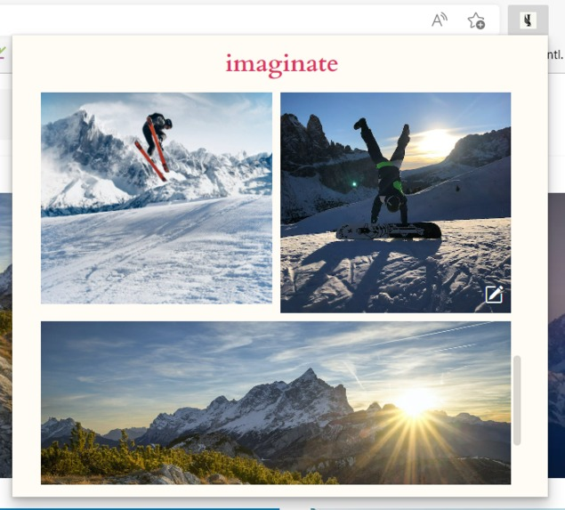

## Inspiration
Our inspiration stems from our search for inspiration. From designers to developers, everybody inevitably scavenges the internet for sources of inspiration on new projects, designs, and ideas. During the research process, however, it is challenging to stay organized and keep track of all these impactful sources of inspiration.

As creative thinkers, we all wish for a method of not only collecting these motivational tokens but also for an opportunity to continue and elaborate on specific ideas that align with our interests. We aim to accomplish this with artificial intelligence.

## What it does
At its core, "imaginate" is a browser extension that allows users to "pin" any image source on the internet and store it in an organized interface. These visual bookmarks help users keep track of helpful sources during their research process while also serving as a basis to build and expand their visions upon.

"Imaginate" takes brainstorming to another level by introducing the Stable Diffusion artificial intelligence model for image generation so that users are able to quickly brainstorm their own sources of inspiration. Users can open any previously pinned image on an options page, where they are then able to enter a prompt describing exactly how they wish for the image to be adjusted down to the smallest detail. Additionally, a simple slider scale allows users to control the degree to which the prompt affects the image.

Lastly, If the user decides the majority of a source aligns closely with their interests, "imaginate" offers the chance to preserve parts of this original source and change only the specific areas that the user desires.
By coloring over the image, a mask is created that tells "imaginate" to change only the marked areas and leaves the rest of the source untouched. This functionality allows users to dive deep into the project and develop their ideas to the fullest.

.jpg)
.jpg)

## How we built it

The frontend of our browser extension itself was built using pure typescript with HTML as well as CSS elements. When the user decides to edit one of the images whose URLs are stored in chrome local storage, our frontend processes user inputs and sends this information to our backend. The canvas, which creates a mask that allows users to specify custom areas of the image to change, is also built with typescript. Our backend, consisting of python powered by Flask, makes API calls to Replicate using the parameters received in HTTP requests from the extension. The end result incorporates the Stable Diffusion artificial intelligence model to generate an image.

## Challenges we ran into

We encountered numerous obstacles throughout the process of creating this project. One of these was image size manipulation: we had to ensure that all the images were resized properly so that they could fit aesthetically into our browser extension. In addition, we found it extremely difficult to draw on a blank canvas that overlays an image, so we were forced to find unique solutions to allow for drawing on top of the original sources. Chrome storage was also an issue, as we found ourselves struggling to upload all the items properly due to byte limits imposed by Chrome. As a result, we used Chrome local storage instead of Chrome sync storage so that we could override the size limits. Trying to connect the Chrome extension to the flask server by sending HTTP POST requests caused many errors, and we had to specify certain HTTP request settings for both Chrome's manifest.json and the flask server. Lastly, the API's NSFW filter presented roadblocks during development since it would crash the flask server without warning even though the code is correct.

## Accomplishments that we're proud of

We are incredibly proud of our extremely resilient commitment to the project in the face of repeated technical setbacks. We are also quite happy with the final result of our frontend design, an example being the grid organization of the browser extension popup as well as the interface to generate new images. Lastly, we're extremely content with the fact that we are able to successfully connect our frontend and backend together to effectively make API calls, completing the image-generating process.

## What we learned

The majority of the technologies we used for this project were relatively unknown to us before. We learned how to use webpack to convert Typescript to a Javascript Chrome extension, send API calls from a Chrome extension, as well as how to create a backend with Python that is powered by Flask. Additionally, we learned how to use Chrome local storage to store items for our extension, and also how to run open-source machine learning models through Replicate.

## What's next for Imaginate

Our future plans include implementing an account authentication system so that you can access your saved images and generated images across different devices. In addition to our browser extension, we could also look into making a mobile app so that you could save and edit images on your phone as well. Lastly, we could look into implementing a model that fine-tunes itself to fit each user's interests and generate images according to the user's personal likes and dislikes. 